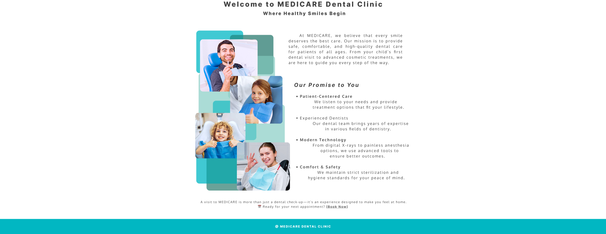

# Medicare: Dental Clinic Management SuperSystem - Frontend

A modern, role-based React application for managing dental clinic operations including patient appointments, billing, inventory, and treatment records.



## Tech Stack

- **React 19** with TypeScript
- **Vite** for build tooling
- **React Router v7** for routing and navigation
- **TanStack React Query** for server state management
- **React Hook Forms** for forms handling
- **Tailwind CSS 4** for styling
- **shadcn/ui** for component library
- **Supabase** for authentication and real-time data
- **PayMongo** for payment processing

## Backend Integration

This frontend connects to multiple backend services with clear domain separation:

| Technology | Responsibility |
|------------|---------------|
| **Django** | Patient appointments, scheduling, reservation fee payments |
| **Flask** | Patient records, EMR, treatment histories |
| **Supabase** | Inventory management, dentist system, |

## Prerequisites

- **Node.js**: v24.11 or higher
- **pnpm**: Package manager
- Access to Supabase project credentials
- PayMongo public API key (for payment integration)

## Getting Started

### 1. Clone the repository

```bash
git clone <repository-url>
```

### 2. Install dependencies

```bash
pnpm install
```

### 3. Environment Setup

Create a `.env` file in the root directory:

```env
# Supabase Configuration
VITE_ENV_SUPABASE_URL=your_supabase_project_url
VITE_ENV_SUPABASE_ANON_KEY=your_supabase_anon_key

# PayMongo Configuration
VITE_ENV_PAYMONGO_PUBLIC_KEY=your_paymongo_public_key

# Backend Services
VITE_ENV_BACKEND_DJANGO_URL=http://localhost:8000
VITE_ENV_BACKEND_FLASK_URL=http://localhost:5000

### 4. Run development server

```bash
pnpm run dev
```

## Project Structure

```
src/
├── components/         # Reusable UI components
│   ├── ui/             # shadcn/ui components (Radix UI primitives)
│   └── shared/         # Shared business components
├── pages/              # Route-based page components
|   |── public/         # Public Views pages
│   ├── patient/        # Patient dashboard pages
│   ├── admin/          # Admin dashboard pages
│   ├── front-desk/     # Front desk subsystem pages
│   ├── inventory/      # Inventory subsystem pages (Supabase)
│   ├── dentist/        # Dentist subsystem pages (Supabase)
│   └── auth/           # Authentication pages
├── hooks/              # Custom React hooks
├── lib/                # Utility functions and configurations
│   ├── api/           # API client setup (Django, Flask)
│   ├── supabase.ts    # Supabase client
│   └── utils.ts       # Helper functions (cn, etc.)
├── types/              # TypeScript type definitions
└── routes/             # Route configuration
```

## Routing Structure

The application uses **React Router v7** with protected routes and nested layouts using `<Outlet />`:

```
/                          # Public landing page
├── /login                 # Authentication
├── /register              # Patient registration
│
├── /patient/*             # Patient Dashboard (Protected)
│   ├── /
│
├── /admin/*               # Admin Dashboard (Protected)
│   ├── /
│
├── /front-desk/*          # Front Desk Subsystem (Protected)
│   ├── /
│
├── /inventory/*           # Inventory Subsystem (Protected)
│   ├── /
│
└── /dentist/*             # Dentist Subsystem (Protected)
    ├── /
```

Each protected route validates user roles and redirects unauthorized access.

### Real-time Updates

Supabase subscriptions are integrated with React Query for automatic cache invalidation on data changes.

## Key Features

- **Role-Based Access Control**: Separate dashboards for patients, dentists, admin, and staff
- **Real-time Updates**: Live updates via Supabase subscriptions (inventory & dentist system)
- **Payment Integration**: PayMongo for reservation fees and billing
- **Responsive Design**: Mobile-first approach with Tailwind CSS
- **Accessibility**: WCAG-compliant components via shadcn/ui (Radix UI)
- **Type Safety**: Full TypeScript coverage

## Available Scripts

```bash
pnpm run dev       # Start development server
pnpm run build     # Build for production
pnpm run preview   # Preview production build
pnpm run lint      # Run ESLint
```
## Environment Modes

### Development
- Connects to local backend services
- Hot module replacement enabled
- Debug logging active

### Production
- Optimized build with code splitting
- Connects to production backend URLs
- Error tracking enabled

## Contributing

This project is part of a collaborative system development effort. Each subsystem (Front Desk, Inventory, Patient Records, Dentist) is maintained by different teams while sharing this unified frontend.


